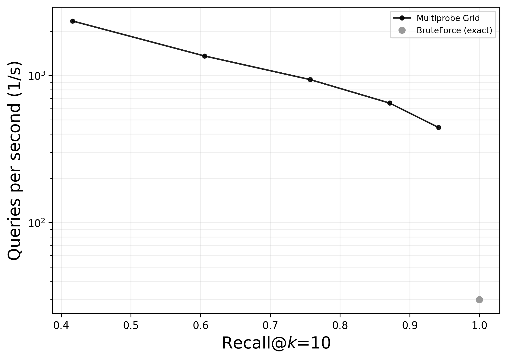

# Tutorial: a Pareto front in ~10 minutes

This walks you from a clean machine to a real **QPS-vs-recall Pareto front** for
the Multi-Probe Grid algorithm, benchmarked through
[ann-benchmarks](https://github.com/erikbern/ann-benchmarks) and plotted against
an exact BruteForce reference. It uses `fashion-mnist-784-euclidean` (60k points)
so the whole pipeline finishes in minutes rather than the hours the full paper
datasets take.

This tutorial uses fashion-mnist purely for speed, to orient you to the workflow.
It is **not** a reproduction of the paper's Fig 1, which is run on much larger,
different datasets (the GloVe family, e.g. glove-200-angular at 1.18M points). To
reproduce the actual paper figure, follow [REPRODUCTION.md](REPRODUCTION.md)
afterwards. See [What you should see](#what-you-should-see) below for how the two
differ and why.

## Prerequisites

- **Docker**, installed and running. ann-benchmarks runs each algorithm in a
  container.
- **conda** (or any way to make a clean Python 3.11 environment).
- A local clone of **ann-benchmarks** (the steps below clone it for you).

## Step 1: one environment that does everything

The benchmark sweep runs inside ann-benchmarks (it needs the `docker` Python SDK
and its other deps), while tuning and the figure scripts need this package. The
simplest setup is a single env with both:

```bash
conda create -n mpann-demo python=3.11 -y
conda activate mpann-demo

git clone https://github.com/erikbern/ann-benchmarks
cd ann-benchmarks && pip install -r requirements.txt && cd ..

# quote the [repro] extra: in zsh the brackets are glob characters
pip install -e '/path/to/MultiProbeANN[repro]'

export ANN_BENCHMARKS_DIR="$PWD/ann-benchmarks"
```

(If you only want to play with the algorithm or run the tests, the standalone
`conda env create -f environment.yml` env is enough. You just cannot run the
Docker sweep from it, which is why this tutorial uses the recipe above.)

## Step 2: integrate Multi-Probe Grid and build its image

```bash
cd /path/to/MultiProbeANN
./ann_benchmarks_integration/setup.sh "$ANN_BENCHMARKS_DIR"
```

This copies `module.py`, `config.yml`, and the `Dockerfile` into the clone and
builds the `ann-multiprobe` image. It runs a preflight check first (the `docker`
SDK plus a running daemon) and fails with guidance if either is missing. On
Apple Silicon it also patches the upstream `hnswlib`, `faiss`, and `faiss_hnsw`
Dockerfiles so they build natively.

## Step 3: build the BruteForce reference image

```bash
cd "$ANN_BENCHMARKS_DIR"
python install.py --algorithm bruteforce
```

BruteForce gives the exact recall-1.0 reference point on the plot.

## Step 4: run the sweep

```bash
cd "$ANN_BENCHMARKS_DIR"
python run.py --algorithm ann-multiprobe --dataset fashion-mnist-784-euclidean --runs 1
python run.py --algorithm bruteforce     --dataset fashion-mnist-784-euclidean --runs 1 --run-disabled
```

ann-benchmarks downloads the dataset on first use. The shipped `config.yml` has a
single operating point (`grid_dims=6, grid_splits=5`) swept over `n_probe`, so the
multiprobe run produces a short 5-point curve. Both runs together take a few
minutes on fashion-mnist.

## Step 5: render the figure

```bash
cd /path/to/MultiProbeANN
python reproduce/fig1_pareto.py \
    --ann-benchmarks-dir "$ANN_BENCHMARKS_DIR" \
    --dataset fashion-mnist-784-euclidean
```

This writes `fig1_pareto_fashion-mnist-784-euclidean.png`.

## What you should see



A monotonic Multi-Probe Grid curve: higher `n_probe` buys higher recall at lower
QPS (note the log QPS axis), with the BruteForce reference sitting at recall 1.0
and much lower QPS (exact, slow). Absolute QPS is hardware-dependent and will not
match the paper or this example; the trend is the result.

### How this differs from the paper's Fig 1

This plot is a fast orientation, not a reproduction of Fig 1. It differs in three
ways worth understanding:

- **Dataset.** Here: fashion-mnist (60k points, 784-d, euclidean). Paper Fig 1:
  glove-200-angular (1.18M points, 200-d, angular). Different N, dimensionality,
  and metric mean different absolute QPS and a different recall/QPS tradeoff.
- **A single config, not the Pareto envelope.** This run uses the one shipped
  operating point (`grid_dims=6, grid_splits=5`) swept over `n_probe` up to 16, so
  the curve stops near recall 0.94. The paper's curve is the upper envelope over
  many NSGA-II-tuned configs, including coarse projections (`grid_dims=2`) that
  reach the high-recall regime. Per the paper's cost model, speedup over brute
  force scales like `grid_splits^grid_dims / n_probe`; pushing recall toward 1.0
  requires probing a large fraction of the data, at which point QPS converges to
  brute force. This single config never enters that regime, which is why
  multiprobe stays well above brute force here.
- **Baselines.** This plot shows only brute force (the exact reference multiprobe
  naturally beats). Fig 1 also includes the optimized C++ baselines (Voyager,
  PyNNDescent, Annoy, FAISS-IVF), against which the Python proof-of-concept is
  generally slower in absolute QPS.

For the full tuned front against all baselines on glove-200-angular, see
[REPRODUCTION.md](REPRODUCTION.md).

## Smoke option (under a minute)

To exercise the whole pipeline even faster, swap in `random-xs-20-angular`. It is
generated locally (no download) and uses the angular operating point in the same
shipped config:

```bash
python run.py --algorithm ann-multiprobe --dataset random-xs-20-angular --runs 1
python run.py --algorithm bruteforce     --dataset random-xs-20-angular --runs 1 --run-disabled
python reproduce/fig1_pareto.py --ann-benchmarks-dir "$ANN_BENCHMARKS_DIR" --dataset random-xs-20-angular
```

## Troubleshooting

- **`zsh: no matches found: ...[repro]`** -- quote the install target:
  `pip install -e '/path/to/MultiProbeANN[repro]'`.
- **Docker daemon not running** -- start Docker Desktop and wait for it:
  ```bash
  open -a Docker
  until docker info >/dev/null 2>&1; do sleep 2; done; echo "docker ready"
  ```
- **setup.sh stops with a deps/daemon message** -- that is the preflight guard.
  Install ann-benchmarks' requirements into the active env (Step 1) and make sure
  Docker is running.

## Next steps

- Reproduce the actual paper Fig 1 (glove-200-angular) and Fig 2b:
  [REPRODUCTION.md](REPRODUCTION.md). Note that large datasets need ann-benchmarks'
  per-container timeout raised (`run.py --timeout`); see that doc.
- Generate a full multiprobe Pareto front (instead of the single shipped point)
  with the NSGA-II search in `tuning/`.
- Tune the algorithm yourself: `grid_dims`, `grid_splits` (build-time) and
  `n_probe` (query-time). See the README for the API.

## Citation, contact, contributing

See the [README](../README.md) for how to cite this work, where to report issues,
and how to contribute.
